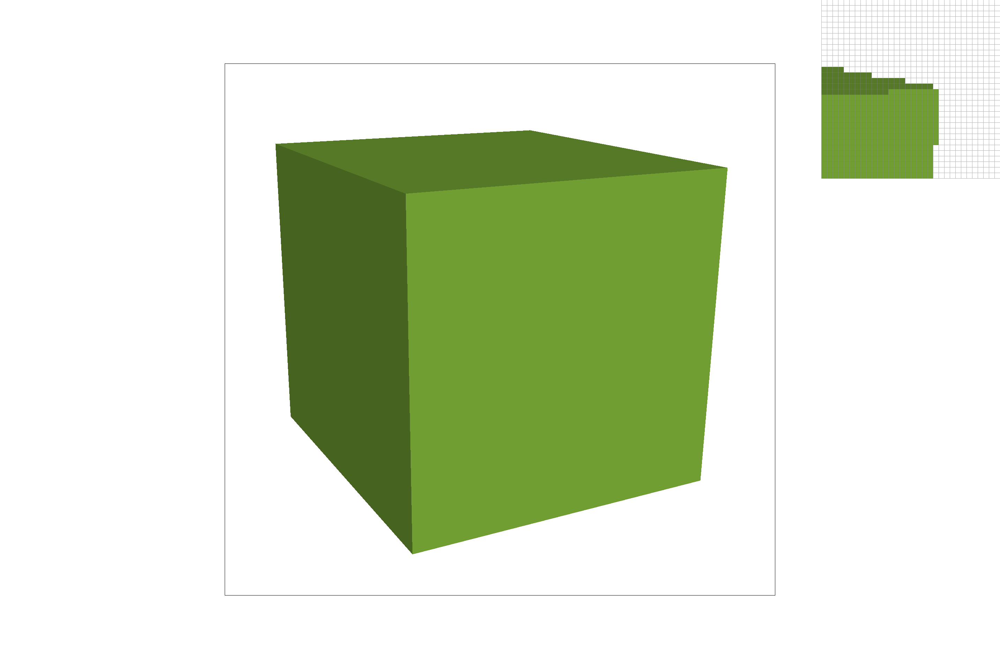
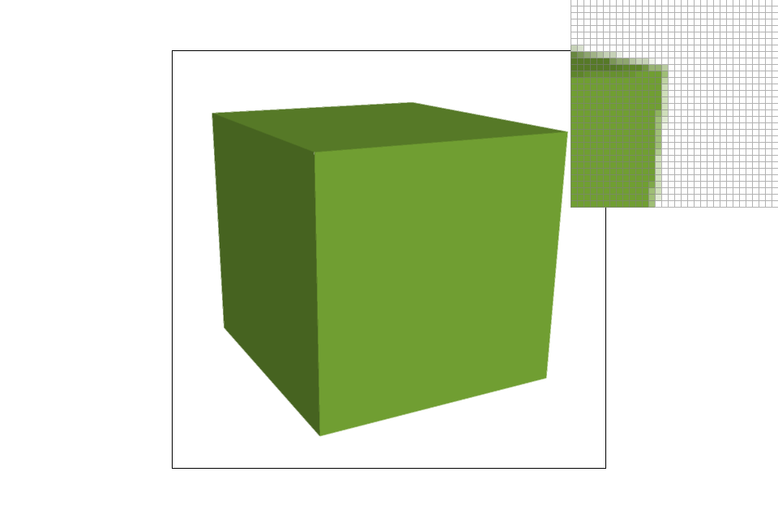
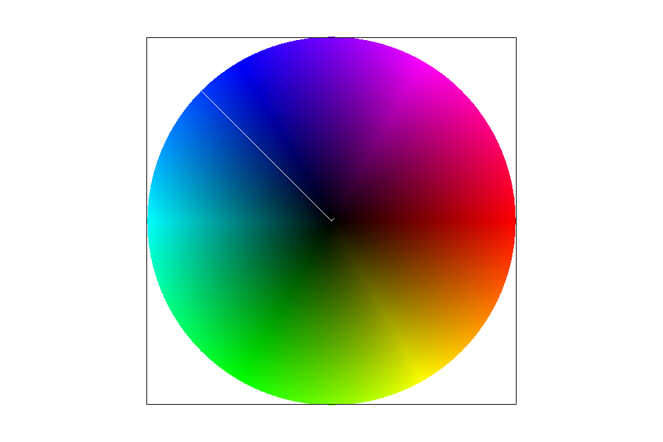

# CS 184: Computer Graphics and Imaging, Spring 2019
## Project 1: Rasterizer
### Zhiming Xu, 3034485754
### Overview
Leave this part for a while
## Section I: Rasterization
### Part 1: Rasterizing single-color triangles
- I think rasterizing a triangle is to color some grids by sampling. Since in real
world, the edges of a triangle are continuous, but on screen, they need to be converted to a finite number of
grids. Therefore, when given the coordinates of endpoints of a triangle, we need to determine those vertices
included in it, and give them correct colors so that they original triangle can be displayed on screen.
- My algorithm first find the min and max value of x's and y's. And only sample the grids within this range, i.e., 
sample all vertices included in the minimum bounding box of the triangle. Therefore, it is exactly the same as 
what's mentioned in the question.
- As is shown in the figure below. 

### Part 2: Antialiasing triangles
- Instead of just sampling once for each pixel, this time we need to sample muliple times for each pixel. 
Concretely, we divide one pixel into `sample_per_side` subpixels per side, therefore, we now need to sample
`sample_per_side * sample_per_side` times for one pixel. And average their values to derive its color. The reason
why supersampling is useful is that it samples more pixels so that better determine to what degree a pixel belongs to
a triangle instead of just deciding inside or not. I added subpixel sampling in previous pixel sampling.
By supersampling, the pixels partially in a triangle are assigned an intermediate color between blank and full.
Thus the edges look smoother.
- As are shown in the figures below.

### Part 3: Transforms
**This area needs to modify original codes, TODO later**
## Section 2: Sampling
### Barycentric coordinates
- I think barycentric coordinates is another way to represent the location of a point within a specific triangle.
-  As is shown in the figure below.

   